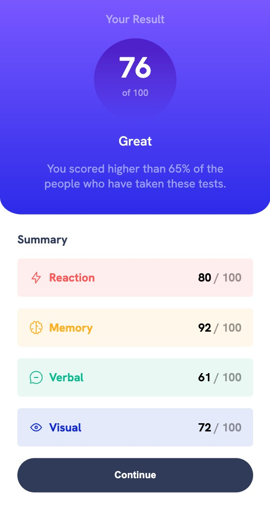

# Frontend Mentor - Results summary component solution

This is a solution to the [Results summary component challenge on Frontend Mentor](https://www.frontendmentor.io/challenges/results-summary-component-CE_K6s0maV). Frontend Mentor challenges help you improve your coding skills by building realistic projects. 

## Table of contents

- [Overview](#overview)
  - [The challenge](#the-challenge)
  - [Screenshot](#screenshot)
  - [Links](#links)
- [My process](#my-process)
  - [Built with](#built-with)
- [Author](#author)

## Overview

### The challenge

Users should be able to:

- View the optimal layout for the interface depending on their device's screen size
- See hover and focus states for all interactive elements on the page
- **Bonus**: Use the local JSON data to dynamically populate the content

### Screenshot

#### Mobile solution

#### Desktop

### Links

- Solution URL: [Repo](https://github.com/alemarr/fm-results-summary-component/)
- Live Site URL: [Live URL](https://alemarr.github.io/fm-results-summary-component/)

## My process

I implemented the mobile design first and then the desktop one. 

After I did that, I worked on the bonus part of the challenge. Now all of the elements in the right / bottom part of the component are rendered dynamically.

### Built with

- Semantic HTML5 markup
- CSS custom properties
- Flexbox
- Mobile-first workflow
- Vanilla JS

## Author

- Frontend Mentor - [@alemarr](https://www.frontendmentor.io/profile/alemarr)
